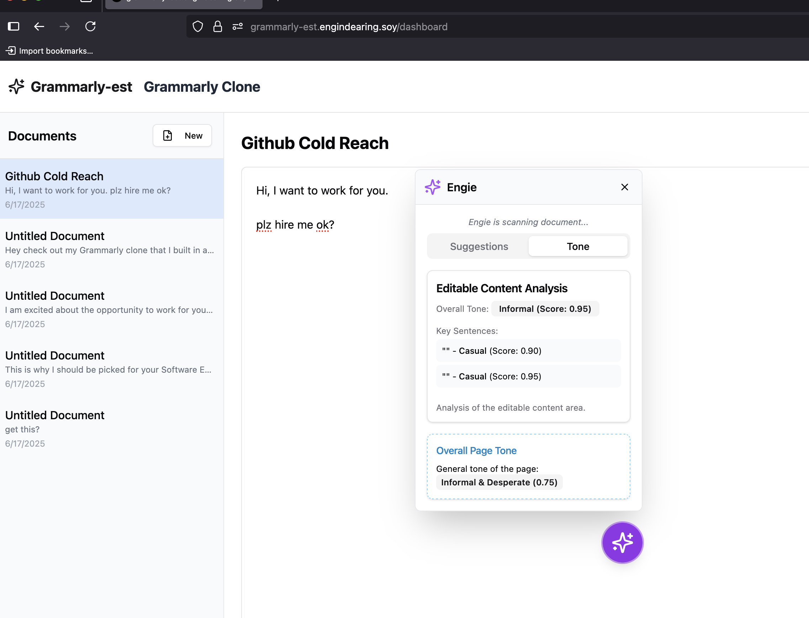

<div align="center">
  
  <h1>Grammarly-EST</h1>
  <p>
    <strong>Your AI-Powered Writing Companion</strong>
  </p>
  <p>
    Welcome to Grammarly-EST, where <strong>EST</strong> stands for <strong>Engie Suggestion Technology</strong>. This isn't just a grammar checker; it's an intelligent writing partner designed to enhance your writing process, understand your context, and help you produce your best work.
  </p>
</div>

---

## ✨ Key Features

- **🤖 Engie, Your AI Companion**: An intelligent assistant that provides contextual writing guidance, proactive suggestions, and encouragement.
- **✍️ AI-Powered Corrections**: Utilizes OpenAI for advanced grammar, spelling, and style corrections.
- **🎨 Context-Aware Assistance**: Engie understands the type of content you're writing—from technical docs to casual chats—and adapts its suggestions accordingly.
- **⚡ Real-Time Feedback**: Get instant suggestions and tone analysis as you type.
- **🌐 Multi-Origin Support**: Seamlessly works across multiple domains and local development environments thanks to robust CORS support.
- **🚀 Modern Tech Stack**: Built with Next.js, TypeScript, and Tailwind CSS for a fast, reliable, and beautiful user experience.
- **📤 Export Functionality**: Easily copy, download, or share your text to other platforms.

## 🛠️ Tech Stack

- **Framework**: [Next.js](https://nextjs.org/)
- **Language**: [TypeScript](https://www.typescriptlang.org/)
- **Styling**: [Tailwind CSS](https://tailwindcss.com/)
- **UI Components**: [Shadcn/ui](https://ui.shadcn.com/)
- **AI Integration**: [OpenAI API](https://openai.com/api/)
- **Database/ORM**: [Prisma](https://www.prisma.io/)
- **Linting**: [ESLint](https://eslint.org/)

## 🚀 Getting Started

Follow these steps to get the project up and running on your local machine.

### 1. Prerequisites

Make sure you have the following installed:
- [Node.js](https://nodejs.org/) (version `20.0.0` or higher, as specified in `package.json`)
- [npm](https://www.npmjs.com/) (usually comes with Node.js)

### 2. Clone the Repository

```bash
git clone https://github.com/jfuginay/grammarly.git
cd grammarly
```

### 3. Install Dependencies

Install the project dependencies using npm:
```bash
npm install
```

### 4. Set Up Environment Variables

You'll need to create a `.env.local` file for your environment variables. You can copy the example file to get started:
```bash
cp .env.example .env.local
```

Now, open `.env.local` and add the necessary API keys and database URLs.
```env
# Required
OPENAI_API_KEY="your_openai_api_key_here"
DATABASE_URL="your_database_url_here"

# For Authentication (generate a secret key)
JWT_SECRET="your_jwt_secret_here"

# Optional - Add custom domains for CORS
ADDITIONAL_ALLOWED_ORIGINS="https://custom-domain.com,http://localhost:3001"
```

## 💻 How to Run Locally

Once you've completed the setup, you can start the development server with the following command. This is the setup we've been using.

```bash
npm run dev
```

The application should now be running at [http://localhost:3000](http://localhost:3000).

## 📜 Available Scripts

Here are some of the other scripts you can run:

- `npm run build`: Creates an optimized production build of the application.
- `npm run start`: Starts the production server.
- `npm run lint`: Lints the code to check for errors and warnings.
- `npm run db-push`: Pushes the Prisma schema to your database.

---

<div align="center">
  Happy writing!
</div>
